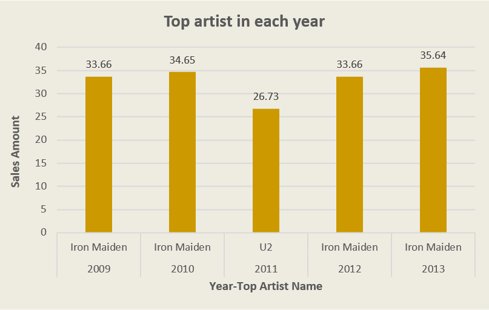
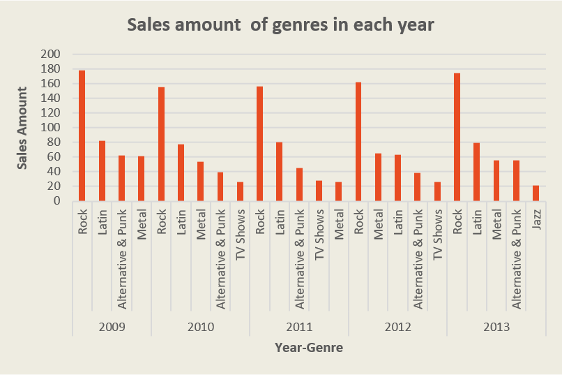
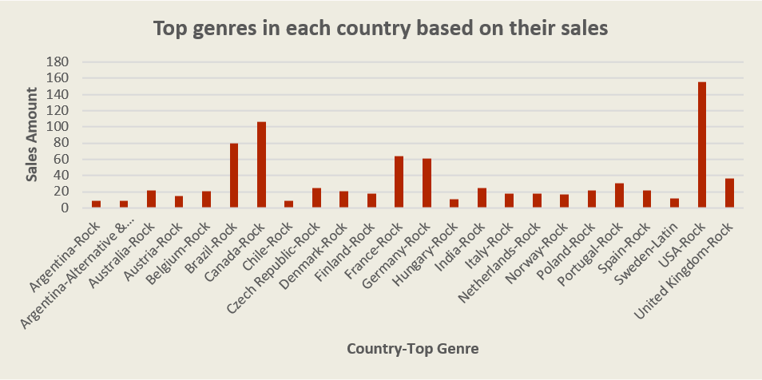
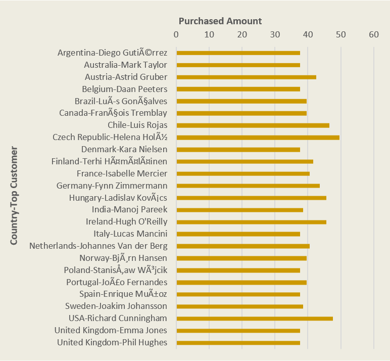

# Analysis of Chinook Database 

### Introduction
I've just finished the Course: [Using SQL for Data Analysis](https://learn.udacity.com/paid-courses/cd0023) at [Udacity](https://www.udacity.com) and this project was a part of my course study.

### Dataset
**Chinook Database** <br>
The Chinook Database holds information about a music store. <br>
For this project, I queried to assist the Chinook team with understanding the media in their store, their customers and employees, and their invoice information.
<br>
The Chinook data model represents a digital media store, including tables for artists, albums, media tracks, invoices, and customers. This sample database includes:

- 11 tables
- A variety of indexes, primary and foreign key constraints
- Over 15,000 rows of data

For details, here's the entity relationship diagram of the Chinook data model.


### Objective & Goals
**In this project, I answered the following questions:**
1) Who is the top artist in each year and its sales?
2) Which are the top genres in each year based on their sales?
3) Which are the top genres in each country based on their sales?
4) Who are the top customers in each country based on their purchase?


### Analysis
1) Who is the top artist in each year and its sales?

To answer this question first let`s look at the query used to answer this question.
```sql
WITH ARTISTS_AMTS AS (
	SELECT 
		STRFTIME('%Y', I.InvoiceDate) YEAR, 
		AR.ArtistId,
		AR.Name ArtistName, 
		SUM(IL.UnitPrice * IL.Quantity) SALE_AMT
	FROM InvoiceLine IL
	JOIN Invoice I ON IL.InvoiceId = I.InvoiceId
	JOIN Track T ON IL.TrackId = T.TrackId
	JOIN Album A ON T.AlbumId = A.AlbumId
	JOIN Artist AR ON A.ArtistId = AR.ArtistId
	GROUP BY STRFTIME('%Y', I.InvoiceDate), AR.ArtistId,AR.Name
)
SELECT 
	AA.YEAR, 
	AA.ArtistId, 
	AA.ArtistName, 
	AA.SALE_AMT
FROM ARTISTS_AMTS AA
JOIN (SELECT YEAR, MAX(SALE_AMT) MAX_SALE_AMT 
	  FROM ARTISTS_AMTS 
	  GROUP BY YEAR) YM 
   ON AA.YEAR = YM.YEAR AND AA.SALE_AMT = YM.MAX_SALE_AMT;

```



In this graph, customers in each country with the highest purchase amount, are shown. Also, their purchased amount has been displayed.
As seen, in the United Kingdom, two customers, have the highest purchase amount.
<br>

2) Which are the top genres in each year based on their sales?

To answer this question first let`s look at the query used to answer this question.
```sql
SELECT 
	STRFTIME('%Y', I.InvoiceDate) YEAR, 
	G.Name GENRE_NAME, 
	SUM(IL.UnitPrice * IL.Quantity) SALE_AMT
FROM InvoiceLine IL
JOIN Invoice I ON IL.InvoiceId = I.InvoiceId
JOIN Track T ON IL.TrackId = T.TrackId
JOIN Genre G ON T.GenreId = G.GenreId
GROUP BY STRFTIME('%Y', I.InvoiceDate), G.Name
HAVING SALE_AMT > 20
ORDER BY 1,3 DESC;

```


In this graph, music genres with sales amount more than $20 in each year, are shown.
As seen, the Rock genre has had the highest sales in all years.
<br>

3) Which are the top genres in each country based on their sales?

First, let`s look at the query used to answer this question.
```sql
SELECT ff.film_category, ff.standard_quartile, COUNT(*) count
WITH COUNTRY_STATS AS 
(
	SELECT C.Country, G.GenreId, G.Name, SUM(IL.UnitPrice * IL.Quantity) SUM_PURCHASE, COUNT(I.InvoiceId) COUNT_PURCHASE
	FROM InvoiceLine IL
	JOIN Track T ON IL.TrackId = T.TrackId
	JOIN Genre G ON T.GenreId = G.GenreId
	JOIN Invoice I ON IL.InvoiceId = I.InvoiceId
	JOIN Customer C ON I.CustomerId = C.CustomerId  
	GROUP BY C.Country, G.GenreId, G.Name
)
SELECT CS.Country ||'-'|| CS.Name COUNTRY_GENRE, CS.SUM_PURCHASE, CS.COUNT_PURCHASE
FROM COUNTRY_STATS CS
JOIN (SELECT GI.Country, MAX(SUM_PURCHASE) MAX_SUM_PURCHASE, MAX(COUNT_PURCHASE) MAX_COUNT_PURCHASE
	  FROM  COUNTRY_STATS GI
	  WHERE COUNT_PURCHASE
	  GROUP BY GI.Country) CSM 
    ON CS.Country = CSM.Country AND CS.SUM_PURCHASE = CSM.MAX_SUM_PURCHASE AND CS.COUNT_PURCHASE = CSM.MAX_COUNT_PURCHASE
ORDER BY CS.Country;

```


In this graph, for each country, the top genre based on their sales amount is shown and also their sales are displayed.
As seen, the Rock genre, in most of the countries is popular.
<br>

4) Who are the top customers in each country based on their purchase?

To answer this question first let`s look at the query used to answer this question.
```sql
WITH CUSTOMER_STATS AS 
(
	SELECT C.Country, C.CustomerId, C.FirstName, C.LastName, SUM(I.TOTAL) SUM_SPENT 
	FROM Customer C
	JOIN Invoice I ON I.CustomerId = C.CustomerId
	GROUP BY C.Country, C.CustomerId, C.FirstName, C.LastName
)
SELECT CS.Country || '-' || CS.FirstName || ' ' || CS.LastName COUNTRY_CUSTOMER, CS.SUM_SPENT
FROM CUSTOMER_STATS CS
JOIN  
	(SELECT CC.Country, MAX(CC.SUM_SPENT) MAX_SUM_SPENT
	 FROM CUSTOMER_STATS CC 
	 GROUP BY CC.Country) CSM 
  ON CS.Country = CSM.Country AND CS.SUM_SPENT = CSM.MAX_SUM_SPENT
ORDER BY 1;

```



In this graph, customers in each country with the highest purchase amount, are shown. Also, their purchased amount has been displayed.
As seen, in the United Kingdom, two customers, have the highest purchase amount.
<br>
